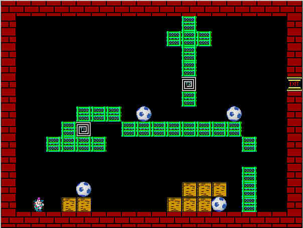

<div align="center">

## Joe Logic II \* Complete\! \* 50 Levels\! \* Now with On Board Level Editting\!\!


</div>

### Description

This is the second and final version of Joe Logic.

It is now complete with 50 Levels!

It features Background music, sound effects,

and complete level editting functionality.

Now you can very easily make, edit and save

your own levels!

The object of the game is to get to the exit on

each of the 50 levels using

blocks, balls, transports, and alot of

logical ingenuity! You will have hours of fun

trying to solve all 50 levels. Movement is

simply done with the 4 arrow keys.

If you are into logic games You will Love the

good clean challenging fun that Joe Logic

will bring you!

The Readme document has all the simple

instructions.

If you make your own levels, PLEASE, send them

to me. I like to play too! :o)
 
### More Info
 


<span>             |<span>
---                |---
**Submitted On**   |2002-05-18 00:17:20
**By**             |[Jose M\. Lopez](https://github.com/Planet-Source-Code/PSCIndex/blob/master/ByAuthor/jose-m-lopez.md)
**Level**          |Intermediate
**User Rating**    |4.9 (113 globes from 23 users)
**Compatibility**  |VB 5\.0, VB 6\.0
**Category**       |[Games](https://github.com/Planet-Source-Code/PSCIndex/blob/master/ByCategory/games__1-38.md)
**World**          |[Visual Basic](https://github.com/Planet-Source-Code/PSCIndex/blob/master/ByWorld/visual-basic.md)
**Archive File**   |[Joe\_Logic\_845675182002\.zip](https://github.com/Planet-Source-Code/jose-m-lopez-joe-logic-ii-complete-50-levels-now-with-on-board-level-editting__1-34909/archive/master.zip)

### API Declarations

```
Sleep
mciSendStringA
sndPlaySound
winmm.dll
```


